# Class Diagram Database PPDB

Dokumen ini berisi class diagram tabel yang dipakai oleh sistem PPDB berdasarkan struktur database final. Tabel bawaan Laravel seperti `jobs`, `cache`, `sessions`, `password_reset_tokens`, dan `personal_access_tokens` tidak disertakan.

```mermaid
classDiagram
    class users {
        id : bigint unsigned
        name : varchar (150)
        nisn : varchar (10) nullable unique
        email : varchar (191) unique
        email_verified_at : timestamp nullable
        password : varchar (255)
        role : enum (admin, peserta)
        remember_token : varchar (100) nullable
        created_at : timestamp nullable
        updated_at : timestamp nullable
    }

    class jalurs {
        id : bigint unsigned
        nama_jalur : varchar (50)
        total_kuota : int
        deskripsi : text nullable
        tgl_buka : datetime nullable
        tgl_tutup : datetime nullable
        created_at : timestamp nullable
        updated_at : timestamp nullable
    }

    class pendaftarans {
        id : bigint unsigned
        no_pendaftaran : varchar (30) unique
        nisn : varchar (10) nullable
        user_id : bigint unsigned
        jalur_id : bigint unsigned
        kampus : varchar (100)
        status_pendaftaran : enum (pending, verifikasi, tes, lulus, tidak_lulus)
        created_at : timestamp nullable
        updated_at : timestamp nullable
    }

    class data_pribadi {
        id : bigint unsigned
        pendaftaran_id : bigint unsigned unique
        foto_profil : varchar (255) nullable
        nama_lengkap : varchar (150) nullable
        tempat_lahir : varchar (100) nullable
        tanggal_lahir : date nullable
        jenis_kelamin : enum (laki-laki, perempuan) nullable
        nik : varchar (16) nullable unique
        no_kk : varchar (16) nullable
        tinggi_badan : int nullable
        berat_badan : int nullable
        status_dalam_keluarga : varchar (50) nullable
        tinggal_bersama : varchar (50) nullable
        anak_ke : int nullable
        jumlah_saudara : int nullable
        agama : varchar (20) nullable
        no_whatsapp : varchar (20) nullable
        alamat : text nullable
        desa : varchar (100) nullable
        kecamatan : varchar (100) nullable
        kabupaten : varchar (100) nullable
        provinsi : varchar (100) nullable
        kode_pos : varchar (5) nullable
        jarak_ke_sekolah : varchar (50) nullable
        waktu_tempuh_ke_sekolah : varchar (50) nullable
        asal_satuan_pendidikan : enum (SMP, MTS) nullable
        nama_asal_sekolah : varchar (150) nullable
        npsn : varchar (8) nullable
        created_at : timestamp nullable
        updated_at : timestamp nullable
    }

    class data_orangtua {
        id : bigint unsigned
        pendaftaran_id : bigint unsigned unique
        nama_ayah : varchar (150) nullable
        nik_ayah : varchar (16) nullable
        tempat_lahir_ayah : varchar (100) nullable
        tanggal_lahir_ayah : date nullable
        pendidikan_terakhir_ayah : varchar (50) nullable
        pekerjaan_ayah : varchar (100) nullable
        penghasilan_ayah : varchar (50) nullable
        no_hp_ayah : varchar (20) nullable
        nama_ibu : varchar (150) nullable
        nik_ibu : varchar (16) nullable
        tempat_lahir_ibu : varchar (100) nullable
        tanggal_lahir_ibu : date nullable
        pendidikan_terakhir_ibu : varchar (50) nullable
        pekerjaan_ibu : varchar (100) nullable
        penghasilan_ibu : varchar (50) nullable
        no_hp_ibu : varchar (20) nullable
        nama_wali : varchar (150) nullable
        nik_wali : varchar (16) nullable
        tempat_lahir_wali : varchar (100) nullable
        tanggal_lahir_wali : date nullable
        pendidikan_terakhir_wali : varchar (50) nullable
        pekerjaan_wali : varchar (100) nullable
        penghasilan_wali : varchar (50) nullable
        no_hp_wali : varchar (20) nullable
        created_at : timestamp nullable
        updated_at : timestamp nullable
    }

    class berkas {
        id : bigint unsigned
        pendaftaran_id : bigint unsigned
        file_raport : varchar (255) nullable
        file_nisn : varchar (255) nullable
        file_foto : varchar (255) nullable
        file_surat_keterangan_aktif : varchar (255) nullable
        file_slip_gaji : varchar (255) nullable
        file_kk : varchar (255) nullable
        file_sertifikat : varchar (255) nullable
        file_sktm : varchar (255) nullable
        file_kip : varchar (255) nullable
        status_berkas : enum (terima, tolak) nullable
        pesan : text nullable
        created_at : timestamp nullable
        updated_at : timestamp nullable
    }

    class ruangans {
        id : bigint unsigned
        nama_ruangan : varchar (50) unique
        lokasi : varchar (150) nullable
        kapasitas : int unsigned nullable
        deskripsi : text nullable
        created_at : timestamp nullable
        updated_at : timestamp nullable
    }

    class mapels {
        id : bigint unsigned
        nama_mapel : varchar (100)
        deskripsi : text nullable
        created_at : timestamp nullable
        updated_at : timestamp nullable
    }

    class jalur_mapel {
        id : bigint unsigned
        jalur_id : bigint unsigned
        mapel_id : bigint unsigned
        urutan : int unsigned
        created_at : timestamp nullable
        updated_at : timestamp nullable
    }

    class jadwal_ujians {
        id : bigint unsigned
        jalur_id : bigint unsigned
        tanggal_ujian : date
        waktu_mulai : time
        waktu_selesai : time
        tanggal_wawancara_btq : date nullable
        waktu_wawancara_btq : time nullable
        tempat_wawancara_btq : varchar (150) nullable
        catatan : text nullable
        created_at : timestamp nullable
        updated_at : timestamp nullable
    }

    class kartu_peserta_ujians {
        id : bigint unsigned
        pendaftaran_id : bigint unsigned unique
        ruangan_id : bigint unsigned nullable
        jadwal_ujian_id : bigint unsigned nullable
        nomor_peserta_ujian : varchar (30) unique
        username_ujian : varchar (50)
        password_ujian : varchar (50)
        generated_at : timestamp nullable
        created_at : timestamp nullable
        updated_at : timestamp nullable
    }

    class pengumumans {
        id : bigint unsigned
        judul : varchar (150)
        keterangan : text
        is_published : tinyint (1)
        published_at : timestamp nullable
        created_at : timestamp nullable
        updated_at : timestamp nullable
    }

    class pengaturan_sistems {
        id : bigint unsigned
        key : varchar (100) unique
        value : text nullable
        created_at : timestamp nullable
        updated_at : timestamp nullable
    }

    users "1" --> "0..1" pendaftarans : memiliki
    jalurs "1" --> "0..*" pendaftarans : dipilih
    pendaftarans "1" --> "0..1" data_pribadi : memiliki
    pendaftarans "1" --> "0..1" data_orangtua : memiliki
    pendaftarans "1" --> "0..*" berkas : mengunggah
    jalurs "1" --> "0..*" jadwal_ujians : memiliki
    jalurs "1" --> "0..*" jalur_mapel : mengatur
    mapels "1" --> "0..*" jalur_mapel : digunakan
    pendaftarans "1" --> "0..1" kartu_peserta_ujians : mendapat
    ruangans "1" --> "0..*" kartu_peserta_ujians : ditempati
    jadwal_ujians "1" --> "0..*" kartu_peserta_ujians : dijadwalkan
```

## Catatan Relasi

- `users` menyimpan akun admin dan peserta. Peserta dapat memiliki satu data `pendaftarans`.
- `pendaftarans` menjadi pusat relasi peserta, jalur, biodata, berkas, dan kartu ujian.
- `data_pribadi` dan `data_orangtua` adalah hasil final pemecahan tabel biodata lama.
- `jalur_mapel` adalah pivot relasi many-to-many antara `jalurs` dan `mapels`.
- `pengumumans` bersifat umum untuk semua peserta, tidak lagi per pendaftaran.
- `pengaturan_sistems` menyimpan konfigurasi sistem seperti data Surat Keterangan Lulus.
